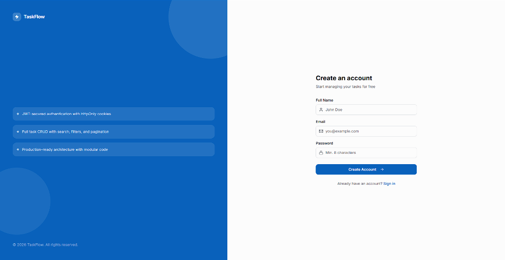
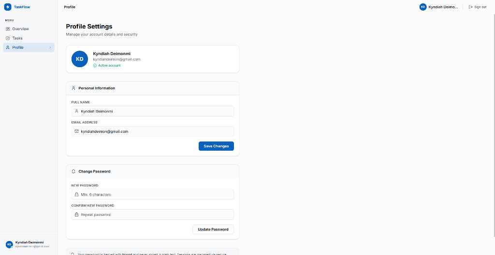
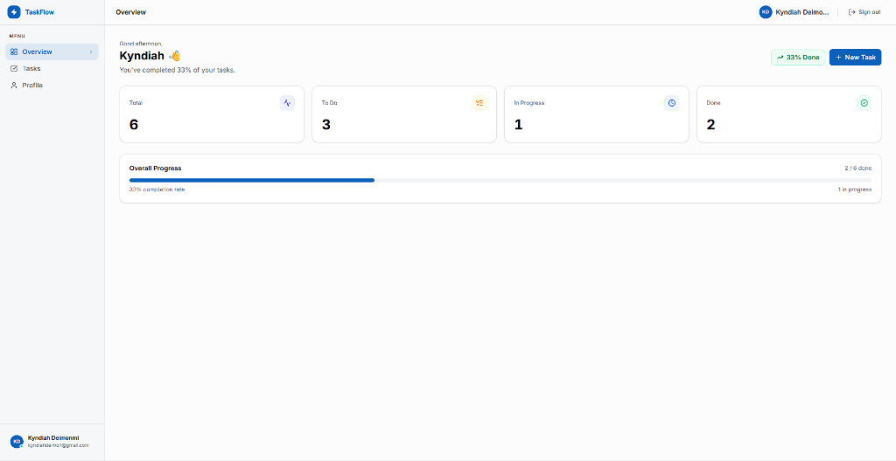
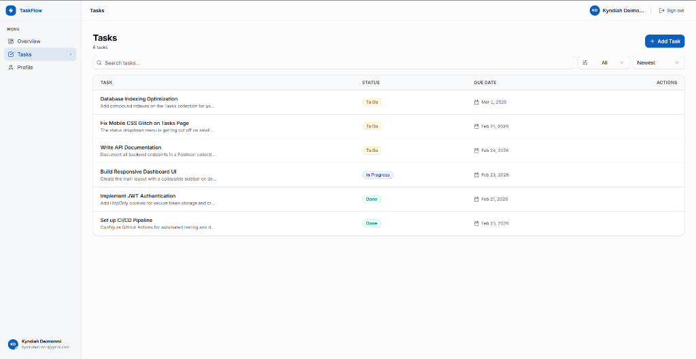

<div align="center">

# ⚡ TaskFlow

### A production-ready SaaS Task Management Platform

[](https://nextjs.org)
[](https://typescriptlang.org)
[](https://nodejs.org)
[](https://mongodb.com)
[](https://tailwindcss.com)

*Secure JWT authentication · Full Task CRUD · Neutral Light SaaS UI*

---

### 🌐 Live Demo
- **Frontend (Vercel):** [https://taskflow-3ipfghiy5-deimon999s-projects.vercel.app](https://taskflow-3ipfghiy5-deimon999s-projects.vercel.app)
- **Backend (Render):** [https://taskflow-a7of.onrender.com/api/health](https://taskflow-a7of.onrender.com/api/health)

> **Note:** The backend uses a free Render instance. It spins down after 15 minutes of inactivity, so the very first request might take ~50 seconds to wake it up.

</div>

---

## ✨ Features

| Category | Details |
|----------|---------|
| 🔐 **Auth** | Register / Login / Logout via **HttpOnly JWT cookies** |
| 🛡️ **Security** | bcrypt hashing · Helmet headers · CORS · Rate limiting |
| 📋 **Tasks** | Create, Read, Update, Delete with ownership validation |
| 🔍 **Search & Filter** | Live text search · Status filter · Sort by date |
| 📄 **Pagination** | Server-side, cursor-driven pagination |
| 🎨 **UI** | Premium dark UI — shadcn/ui + Tailwind + glassmorphism |
| ⚡ **Validated** | Zod (client) + express-validator (server) on every form |
| 📱 **Responsive** | Mobile-first layout with adaptive sidebar and bottom nav |

---

## 📸 Screenshots

*(Replace the placeholder images below by dropping your actual screenshots into the `screenshots/` folder)*

| Login / Register | Dashboard Overview |
| :---: | :---: |
|  |  |

| Tasks View (Desktop/Mobile) | Profile Settings |
| :---: | :---: |
|  |  |

---

## 🗂️ Project Structure

```
task-dashboard/
│
├── 📁 backend/
│   └── src/
│       ├── controllers/      # Business logic (auth, user, task)
│       ├── middleware/        # JWT protect, error handler, rate limiter, validator
│       ├── models/            # Mongoose schemas — User, Task
│       ├── routes/            # Express routers — auth, users, tasks
│       └── utils/             # DB connect, JWT token generator
│
└── 📁 frontend/
    └── src/
        ├── app/
        │   ├── login/         # Login page
        │   ├── register/      # Register page
        │   └── dashboard/     # Protected dashboard
        │       └── tasks/     # Task management page
        ├── components/        # TaskModal, ProtectedRoute, shadcn/ui
        ├── context/           # AuthContext — global auth state
        └── lib/               # Axios API client (withCredentials)
```

---

## 🚀 Getting Started

### Prerequisites
- **Node.js** 18+
- **MongoDB** running locally (`mongod`) or a [MongoDB Atlas](https://mongodb.com/atlas) connection string

---

### 1 — Backend

```bash
cd task-dashboard/backend
npm install
```

Create **`.env`** in `/backend`:

```env
PORT=5000
MONGODB_URI=mongodb://localhost:27017/task-dashboard
JWT_SECRET=your_super_secret_key_here_min_32_chars
NODE_ENV=development
FRONTEND_URL=http://localhost:3000
```

```bash
npm run dev      # Start with nodemon (hot-reload)
```

> ✅ You should see: `Server running on port 5000` + `MongoDB Connected`

---

### 2 — Frontend

```bash
cd task-dashboard/frontend
npm install
```

Create **`.env.local`** in `/frontend`:

```env
NEXT_PUBLIC_API_URL=http://localhost:5000/api
```

```bash
npm run dev      # Start Next.js dev server
```

> ✅ Open **[http://localhost:3000](http://localhost:3000)** — you'll be redirected to `/login`

---

## 📡 API Reference

> **Base URL:** `http://localhost:5000/api`  
> 🔒 Protected routes require a valid JWT cookie (set automatically on login)

### 🔑 Auth

| Method | Endpoint | Auth | Body / Params |
|--------|----------|------|--------------|
| `POST` | `/auth/register` | ❌ | `{ name, email, password }` |
| `POST` | `/auth/login` | ❌ | `{ email, password }` |
| `POST` | `/auth/logout` | ❌ | — |

### 👤 Users

| Method | Endpoint | Auth | Body |
|--------|----------|------|------|
| `GET` | `/users/me` | 🔒 | — |
| `PUT` | `/users/me` | 🔒 | `{ name?, email?, password? }` |

### ✅ Tasks

| Method | Endpoint | Auth | Description |
|--------|----------|------|-------------|
| `POST` | `/tasks` | 🔒 | Create task |
| `GET` | `/tasks` | 🔒 | List tasks *(see query params below)* |
| `GET` | `/tasks/:id` | 🔒 | Get single task |
| `PUT` | `/tasks/:id` | 🔒 | Update task |
| `DELETE` | `/tasks/:id` | 🔒 | Delete task |

**`GET /tasks` — Query Parameters:**

| Param | Type | Description |
|-------|------|-------------|
| `page` | number | Page number (default: `1`) |
| `limit` | number | Items per page (default: `10`) |
| `status` | string | `todo` \| `in-progress` \| `done` |
| `sort` | string | `newest` \| `oldest` \| `dueDate` |
| `search` | string | Full-text keyword search |

### ⚠️ Error Response Format

All errors return a consistent shape:

```json
{
  "message": "Validation Error",
  "fieldErrors": {
    "email": "Invalid email address"
  }
}
```

---

## 🔒 Security Design

```
┌─────────────────────────────────────────────────────┐
│  Registration         Password → bcrypt (10 rounds) │
│  Login                JWT signed (1hr expiry)        │
│  Cookie               HttpOnly · SameSite=Strict     │
│  Every API request    JWT verified via middleware    │
│  Task access          Owner-only (403 if mismatch)  │
│  Rate limit (global)  100 req / 15 min per IP       │
│  Rate limit (auth)    5 req / hour per IP            │
│  HTTP Headers         Hardened via Helmet            │
└─────────────────────────────────────────────────────┘
```

---

## 📬 Postman Collection

Import **[`taskflow-api.postman_collection.json`](./taskflow-api.postman_collection.json)** from the repo root.

1. Open Postman → **Import**
2. Select the JSON file
3. Set base URL variable to `http://localhost:5000/api`
4. Run **Register** or **Login** first — the cookie is set automatically

---

## 📈 Scaling for Production

See **[`SCALING.md`](./SCALING.md)** for the full architecture breakdown.

| Concern | Dev | Production |
|---------|-----|------------|
| Auth | 1hr JWT cookie | Access + Refresh tokens (Redis) |
| Frontend Hosting | `localhost:3000` | Vercel (Edge CDN) |
| Backend Hosting | `localhost:5000` | Docker → Railway / AWS ECS |
| Database | Local MongoDB | MongoDB Atlas (replica set) |
| Caching | None | Redis (profiles, rate limiting) |
| Secrets | `.env` file | AWS Secrets Manager / Vault |

---

## 🛠️ Tech Stack

<div align="center">

| Layer | Stack |
|-------|-------|
| **Frontend** | Next.js 16 · TypeScript · TailwindCSS · shadcn/ui · Axios · React Hook Form · Zod |
| **Backend** | Node.js · Express · TypeScript · JWT · bcrypt · Helmet · express-rate-limit |
| **Database** | MongoDB · Mongoose |
| **Dev Tools** | nodemon · ts-node · ESLint |

</div>

---

<div align="center">

Built with ❤️ for the Frontend Developer Intern Assignment

</div>
